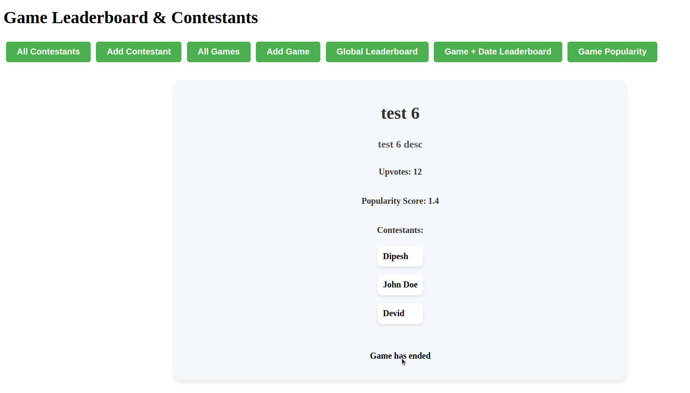

# Startup Script Instructions

## Prerequisites
Make sure you have the following installed on your system:

- Python 3.10.12

- Node.js - v20.17.0
- npm - 10.8.3

## Steps to Run the Application

1. **Make the startup script executable:**
   ```bash
   chmod +x startup.sh
   ```

2. **Run the startup script:**
   ```bash
   ./startup.sh
   ```

## Stopping the Application

press `CTRL+C` in the terminal running the script.

---
### Backend API (FASTAPI) Routes

 See all backend routes :-  [http://127.0.0.1:8000/docs#/](http://127.0.0.1:8000/docs#/)  
---
---
## Demo Video
[](https://youtu.be/6oI8oCV7T1s)

- ### Screenshots





